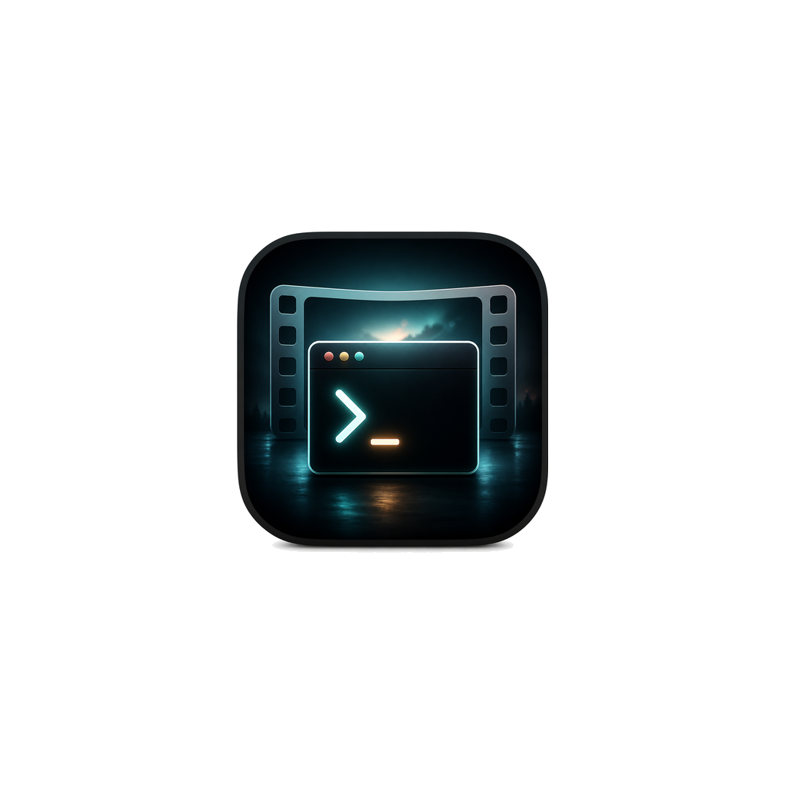
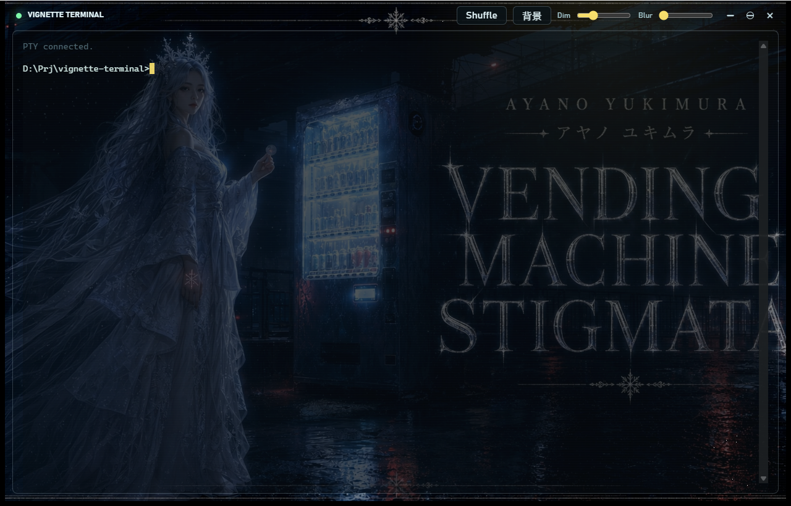

<div align="center">
  
  <h1>Vignette Terminal</h1>
  <p><strong>動画背景をランダム再生できる、Tauri 製のシネマティックなターミナルアプリ。</strong></p>

  <p>
    <a href="README.md">English</a>
  </p>

  <p>
    
    
    
  </p>
</div>

## ✨ 特長

- アプリ同梱の MP4 背景動画を再生
- ランダム選択と滑らかなクロスフェード
- `portable-pty` による Windows コマンドプロンプト実行
- 透明な `xterm.js` ターミナルレイヤーとリンク対応
- フレームレス Tauri ウィンドウ、独自ボタン、ドラッグ可能な上部バー
- `背景` ボタンからローカル画像・動画を選択可能

## 📸 プレビュー



Vignette Terminal は、ただの黒い矩形ではなく、集中できる映像空間として使えるコマンドプロンプトを目指しています。文字の読みやすさを残しつつ、背景動画の存在感も楽しめます。

## 🚀 クイックスタート

前提:

- Node.js 20 以上
- `rustup` で入れた Rust ツールチェーン
- Windows では Visual Studio Build Tools の C++ ワークロード

```powershell
npm install
npm run tauri dev
```

本番ビルド:

```powershell
npm run tauri build
```

実行ファイルとインストーラーは以下に生成されます。

```text
src-tauri/target/release/
src-tauri/target/release/bundle/
```

## 🎬 背景メディア

既定の背景動画は以下にあります。

```text
src/assets/media/
```

自分の MP4 に置き換える場合は、`src/main.js` の `defaultPlaylist` を更新してください。実行中に `背景` ボタンからローカルメディアを選ぶこともできます。

## 🧭 ドキュメント

ローカルで確認:

```powershell
npm run docs:dev
```

ビルド:

```powershell
npm run docs:build
```

## 🛠️ 技術スタック

- Tauri 2
- Vanilla HTML/CSS/JavaScript
- xterm.js
- portable-pty
- Vite
- VitePress

## 🤝 コントリビューション

Issue と Pull Request を歓迎します。変更は目的を絞り、関連するビルド確認を行い、生成済みインストーラー、`node_modules`、`src-tauri/target` はコミットしないでください。

## 📄 ライセンス

MIT License。詳細は [LICENSE](LICENSE) を参照してください。
